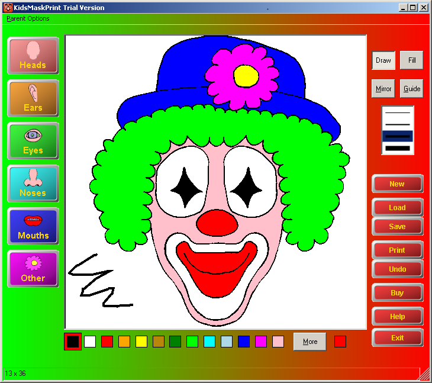
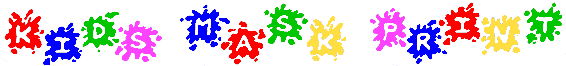
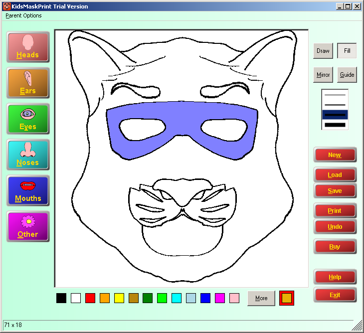
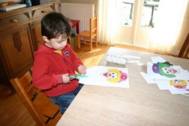
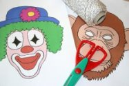
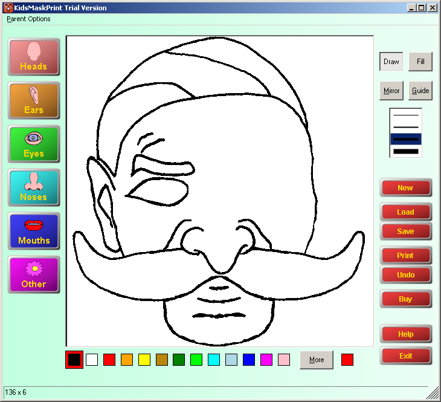
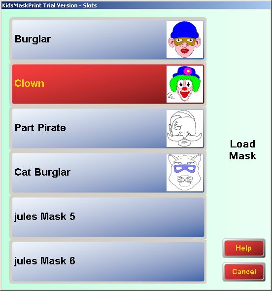

Kids Mask Print
=========

    

Kids Mask Print is windows desktop app aimed at kids and parents. It allows kids to create cool masks out of a range of face parts. Then can then either print the black white mask and colour in with felt tip pen. Or use the application to colour in the mask for you. It allows multiple kids to save their own accounts and masks. Written by [Jules Moorhouse](https://www.julesmoorhouse.com).

 

# Table of contents

* [Features and functionality](#features-and-functionality)
* [Background](#background)
* [How to build / edit the code](#how-to-build--edit-the-code)
* [Installation](#installation)

# Features and functionality
 
 

 

## Features

 * Kids Mask Print, lets kids build and draw masks, colour in the program or print and then colour them with a felt tip pen.
* Keep them occupied with hours of fun and enjoyment.
* Loads of different face parts, which can be used to create hundreds of different masks.

 

* Build, draw, print out masks and then colour them with felt tip pen.
* Help your child to play in the safety of your own home.
* Encourages artistic skills AND basic computer skills
* You can also change the programs colour, pink, blue, wild etc

 

* Kids Mask Print, is a program which is aimed at both children and parents, depending on age and skill. The program is designed to create masks which can be worn. This is done by selecting face parts and adding them to the mask. Freehand lines can also be used with colour to great effect.

 

* Masks can be created in just black and white which can then be printed and coloured in with felt tip by the child; or can be flood filled (filled with colour) so the child does not have to coloured with Felt tip pen. The feature is handled by parent options.

 

* Kids Mask Print comes with a basic selection of face parts which can be used to create a great number of different mask variations.

 

* This is an ideal gift for a child of any age. The program can also be used by the parent to produce masks for a number of children perhaps for a party.

 

# Background

Kids Mask Print was written between XXXXX.

Although Kids Mask Print was written in VB.Net, later I moved to Real Basic, as at the time the Dot Net Framework download was quite a burden, with lack of capacity in Internet access. 

With Real Basic I also changed the name of the app to Kids Mask Factory.

 

# How to build / edit the code

You’ll need Microsoft Visual Basic .Net 2003, you can download this as part of your MSDN benefits.

You will also probably need to use Windows 7 or earlier.

Perhaps in the future I may upgrade this project if this becomes a popular request.

I have included a Components folder which includes most of the required DLLs.

You’ll notice there are two project files for Kids Mask Print and a number of DLLs suffixed with Debug, these are added to one solution for easier debugging. (Why, well there needs to be separate solution to allow for obfuscating / strong name signing, which is used in the batch files.)

So the easiest way to compile the project is to open \CodeLibrary\SharewareProjs\IdeasPad\IdeasPadDebug.sln XXXX

However you can also use the batch files in the build folder, start with the DLLs.

 

# Installation

You can install the app via [kmpinst.exe](https://github.com/Jules2010/KidsMaskPrint/raw/master/Build/KMP/Nsis/kmpinst.exe) which will inform you about any system requirements you don't already have.

 

# Contributing
Contributions for bug fixing or improvements are welcomed. Feel free to submit a pull request.

 

# License
Usage is provided under the [MIT License](http://opensource.org/licenses/mit-license.php). See LICENSE for the full details.
